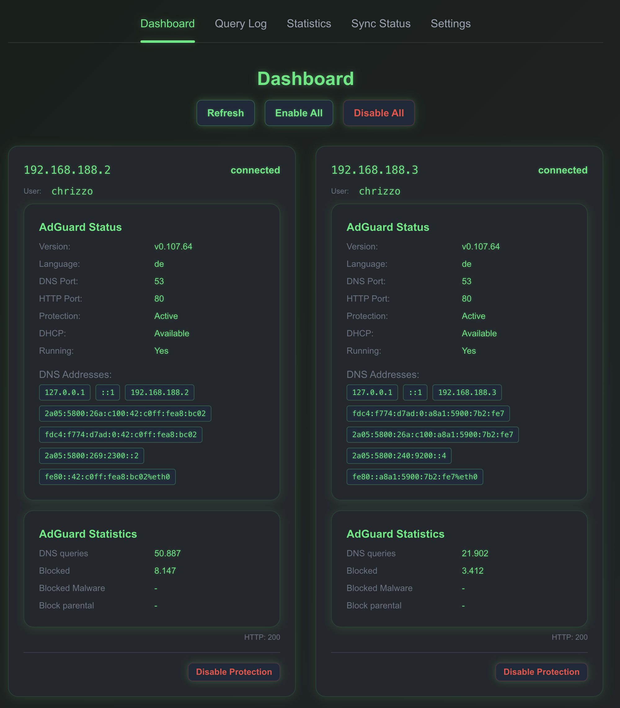
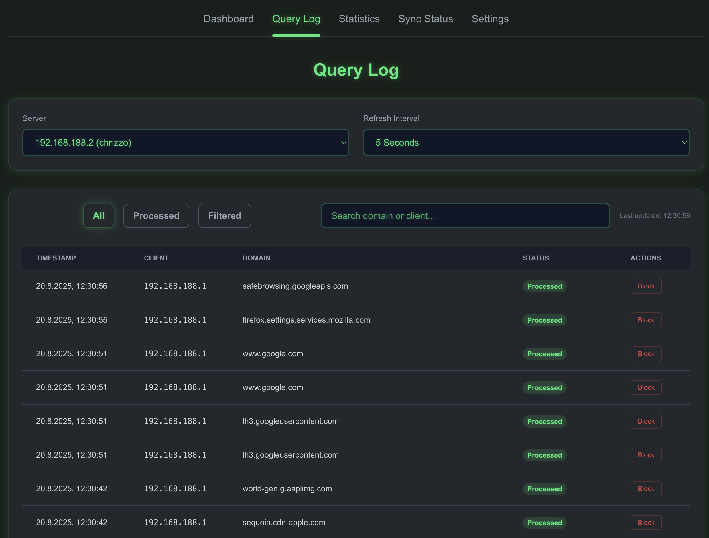
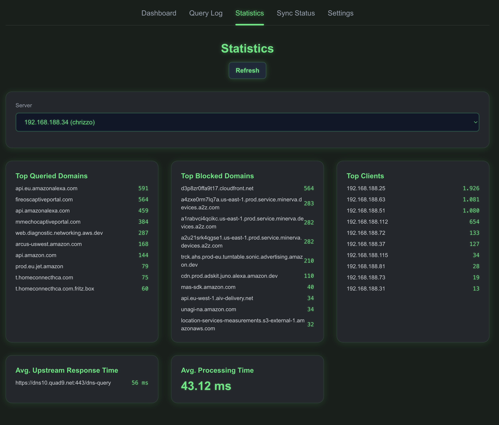
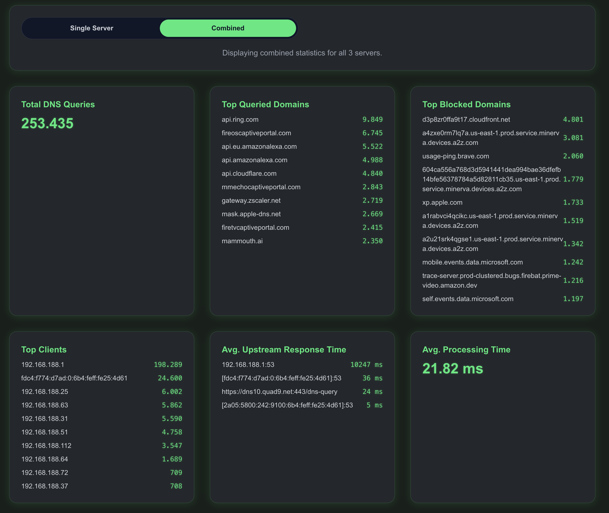
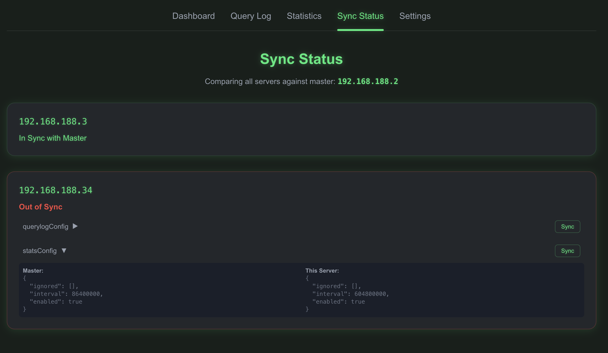
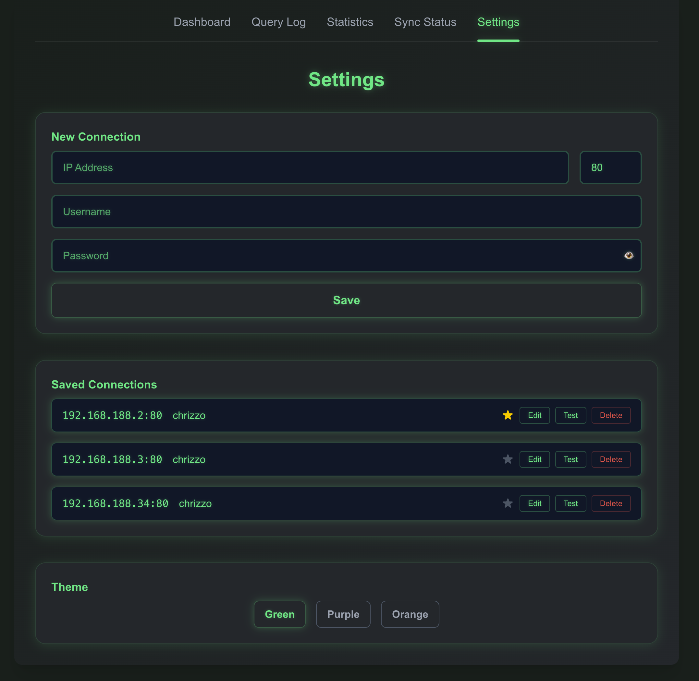

<p align="center">
	
</p>

# AdGuard Buddy


> A modern dashboard & API interface for AdGuard Home – simple, fast, and clear.

---

## 🎯 Goal

**AdGuard Buddy** is designed to keep multiple AdGuard Home instances synchronized, allowing you to monitor statistics, logs, and settings of all your AdGuard servers in one place. 

One server acts as the master, and its settings can be synchronized to the other servers. The Sync viw clearly shows when servers are not in sync with the master, so you always know the current status. Easily view, manage, and control several AdGuard installations from a single point – perfect for users with multiple AdGuard instances.

---

---

## 🚀 Features

- Clean Next.js dashboard for AdGuard Home
- API interface for AdGuard Home functions
- Log and statistics visualization
- Manage filtering rules and connections
- Category synchronization
- Dark/Light mode
- Docker support

---

## 🛠️ Installation

### Local

```bash
pnpm install
pnpm dev
```

### Pre-Build Image:

You can find it here:
https://github.com/chrizzo84/adguard-buddy/pkgs/container/adguard-buddy

### Docker

```bash
docker build -t adguard-buddy .
docker run -p 3000:3000 adguard-buddy
```

---
## ⚙️ Environment Variables

**Required:**

- `NEXT_PUBLIC_ADGUARD_BUDDY_ENCRYPTION_KEY` — Used to encrypt/decrypt AdGuard Home passwords stored in `.data/connections.json`. Set this in your environment for secure password handling. Example:

```bash
export NEXT_PUBLIC_ADGUARD_BUDDY_ENCRYPTION_KEY="your-strong-key"
```

If not set, defaults to `adguard-buddy-key` (not recommended for production).

---

## 📋 API Endpoints

The main API routes are located in `src/app/api/`:

- `/api/adguard-control` – Control AdGuard Home
- `/api/query-log` – Query logs
- `/api/statistics` – Fetch statistics
- `/api/set-filtering-rule` – Set filtering rules
- `/api/get-connections` – Show connections
- ...and more

---

## 🖼️ Screenshots


---
---

---
---


---
---

---
---


---

## 🤝 Contributors

- [chrizzo84](https://github.com/chrizzo84) – Maintainer

---

## 📄 License

MIT

